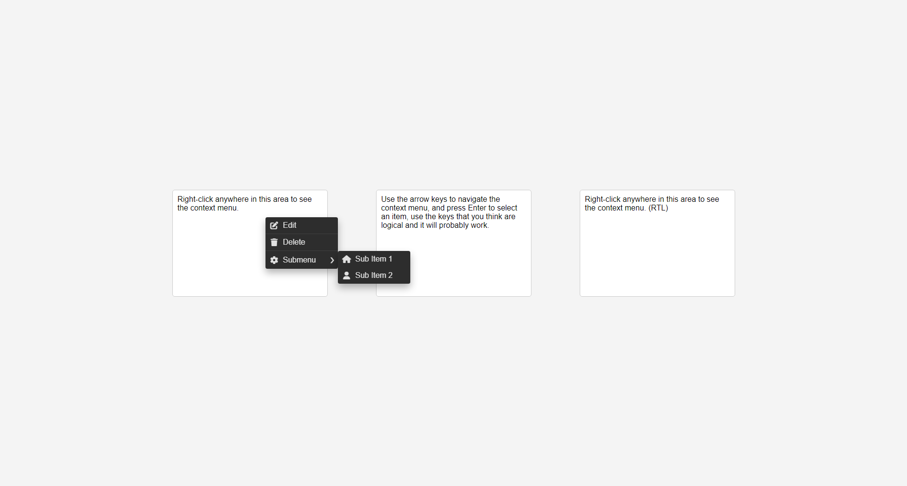

# ContextMenu.js

`ContextMenu.js` is a JavaScript class that dynamically creates and manages context menus for web applications. It allows developers to add custom buttons, separators, and submenus with flexible layout options, including RTL support and animation configurations.

## Table of Contents
- [Features](#features)
- [Installation](#installation)
- [Usage](#usage)
- [Configuration](#configuration)
- [Methods](#methods)
- [Event Handling](#event-handling)
- [Example](#example)
- [License](#license)

## Features
- **Dynamic Menu Creation**: Easily add buttons, separators, and submenus.
- **Customizable Layout**: Configure menu dimensions, RTL (Right-to-Left) support, and spacing.
- **Animation Support**: Set animation duration and easing for smoother menu transitions.
- **Keyboard Accessibility**: Supports keyboard navigation with key event handling for improved accessibility.
- **Event Handling**: Attach event listeners for click, context menu, mouseover, and keypress actions.
- **Automatic Submenu Positioning**: Ensures submenus appear within the viewport without clipping.



## Installation
1. Download or clone this repository.
2. Include `ContextMenu.js` in your project:
   ```html
   <script src="path/to/ContextMenu.js"></script>
   ```

## Usage
1. **Instantiate**: Create an instance of `ContextMenu` with optional configuration.
   ```javascript
   const contextMenu = new ContextMenu({
       initialXOffset: 10,
       initialYOffset: 20,
       menuWidth: 250,
       animationDuration: 300,
       RTL: false
   });
   ```
2. **Add Buttons, Separators, and Submenus**:
   ```javascript
   contextMenu
       .addButton({ text: 'Save', action: saveAction })
       .addSeparator()
       .addSubMenu({ text: 'More Options', subMenu: anotherContextMenu });
   ```
3. **Display Menu**: <br>
    Bind the context menu to an element and show it at the cursor position.
   ```javascript
   element.addEventListener('contextmenu', (e) => {
       e.preventDefault();
       contextMenu.showAt(e.clientX, e.clientY);
   });
   ```
   Or, display the menu at a specific position:
   ```javascript
    contextMenu.showAt(x, y);
    ```
   
### Keyboard Navigation
- **Arrow Keys**: Navigate through menu items.
- **Enter/Space**: Trigger button action or open submenu.
- **Escape**: Close the menu.
- **Tab/Shift+Tab**: Move focus to the next/previous focusable element.
- **Arrow Keys**: Navigate through submenus.
  - **Right/Left**: Open/close submenu. (depends on RTL setting)
  - **Up/Down**: Navigate through (sub)menu items.

## Configuration
The following properties can be set on initialization:
- **initialXOffset**: Horizontal offset for the menu position. (Default: `0`)
- **initialYOffset**: Vertical offset for the menu position. (Default: `10`)
- **menuWidth**: Width of the menu in pixels. (Default: `200`)
- **animationDuration**: Duration for menu animations in milliseconds. (Default: `200`)
- **RTL**: Enables Right-to-Left layout if set to `true`. (Default: `false`)

## Methods
### `addButton(button)`
Adds a button to the context menu.
- `button`: Object with `text` (string) and `action` (function) properties.

### `addSeparator()`
Adds a separator to the context menu.

### `addSubMenu(submenu)`
Adds a submenu to the context menu.
- `submenu`: Object with `text` (string) and `subMenu` (another `ContextMenu` instance).

### `showAt(x, y)`
Displays the context menu at the specified `(x, y)` coordinates.

### `destroy()`
Removes the context menu from the DOM and unbinds all event listeners.

## Event Handling
Event handlers are bound for:
- **Click**: Executes button action and hides the menu when clicking outside.
- **Context Menu**: Prevents the default context menu.
- **Mouseover**: Displays submenus on hover.
- **Keypress**: Handles navigation and interaction using keyboard arrows, Enter, Space, and Escape keys.

## Example
```javascript
const menu = new ContextMenu({
    menuWidth: 180,
    RTL: false,
    animationDuration: 250
});

menu.addButton({ text: 'Open', action: openFile })
    .addButton({ text: 'Save', action: saveFile })
    .addSeparator()
    .addButton({ text: 'Exit', action: closeApp });

document.addEventListener('contextmenu', (e) => {
    e.preventDefault();
    menu.showAt(e.clientX, e.clientY);
});
```

## License
This project is licensed under the MIT License. See the [LICENSE](LICENSE) file for details.
